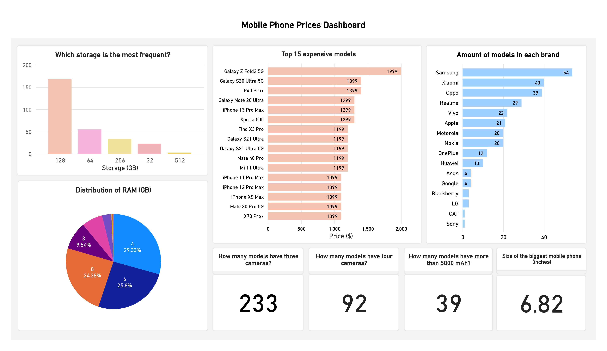

<h1>Data Analysis Portfolio Project 1. Mobile Phone Prices</h1>

<h2>Using a Kaggle dataset for Data cleaning, Feature engineering, Exploratory data analysis and exporting it to Power BI to create a dashboard.</h2>

**Skills used:**

+ Pandas
+ Numpy
+ Matplotlib
+ Seaborn
+ Power BI

Link to the Kaggle dataset: https://www.kaggle.com/datasets/rkiattisak/mobile-phone-price

This dataset contains information on the prices of several mobile phones from different brands. It includes details such as the storage capacity, RAM, screen size, camera specifications, battery capacity, and price of each device.

The raw dataset looks as follows:

**1. After checking for missing values, duplicates, datatypes of the features and the shape of the dataset, I apply Feature Engineering on the features. One of the instances looks as follows:**

Using regex, I extracted each camera and distributed them into new columns. Where there were fewer than 4 cameras, empty values were filled with "NaN."

**2. The final appearance of the cleaned dataset:**

**3. Conducting Exploratory Data Analysis:**

    
    

    
    

    
    

Insights from the plots:

+ Samsung has the most models, followed by Xiaomi and Oppo.
+ Mobile phones in this dataset have an average RAM of 6 GB.
+ 128 GB is the most frequent storage in this dataset.
+ Mobile phones in this dataset have an average screen size of 6.5 inches.
+ The majority have battery capacities between 4000 and 6000 mAh.
+ According to the correlation matrix, storage capacity and RAM have the greatest impact on the price of a mobile phone. The correlation between the cameras and the price can be distorted because they are irregularly distributed.

  
**4. Creating a dashboard in Power BI:**

The whole python code: [Kaggle Notebook](project_1.ipynb)
