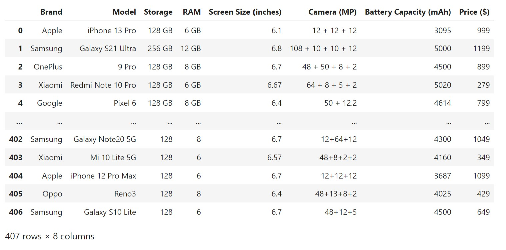
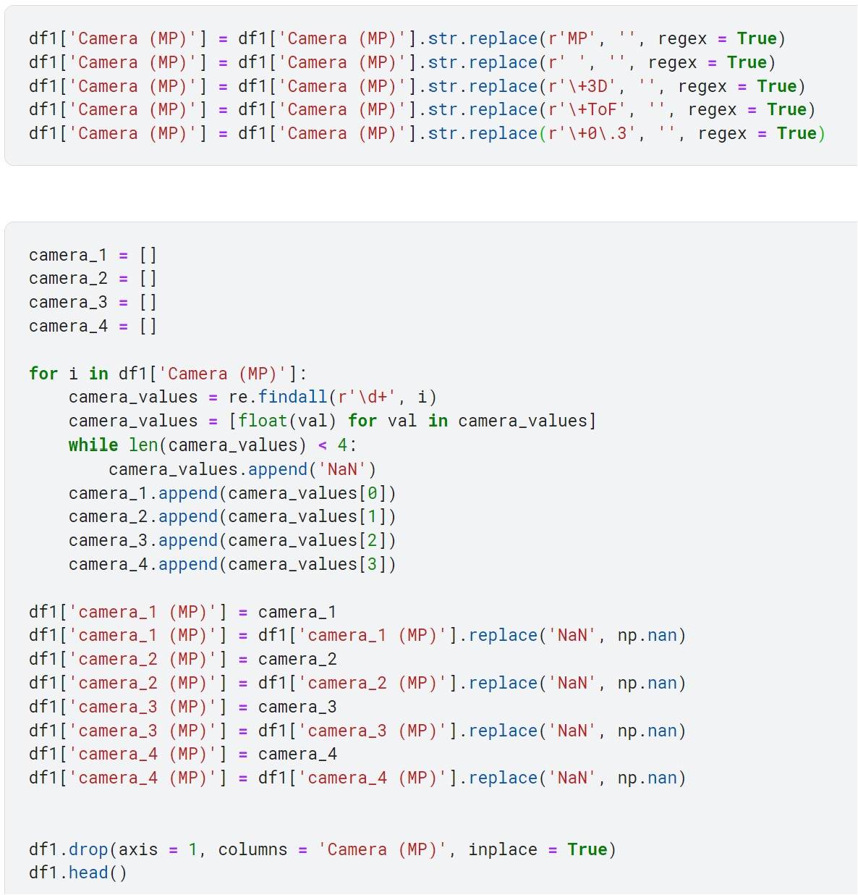
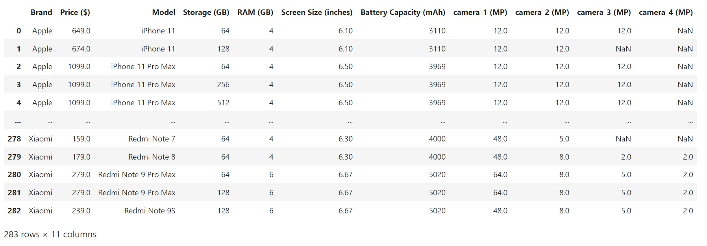
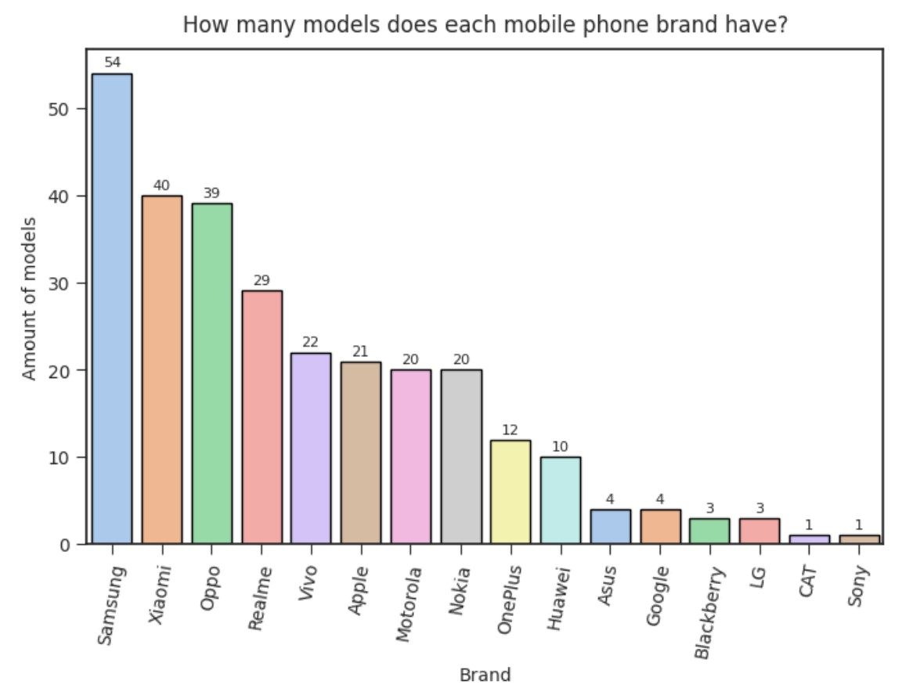
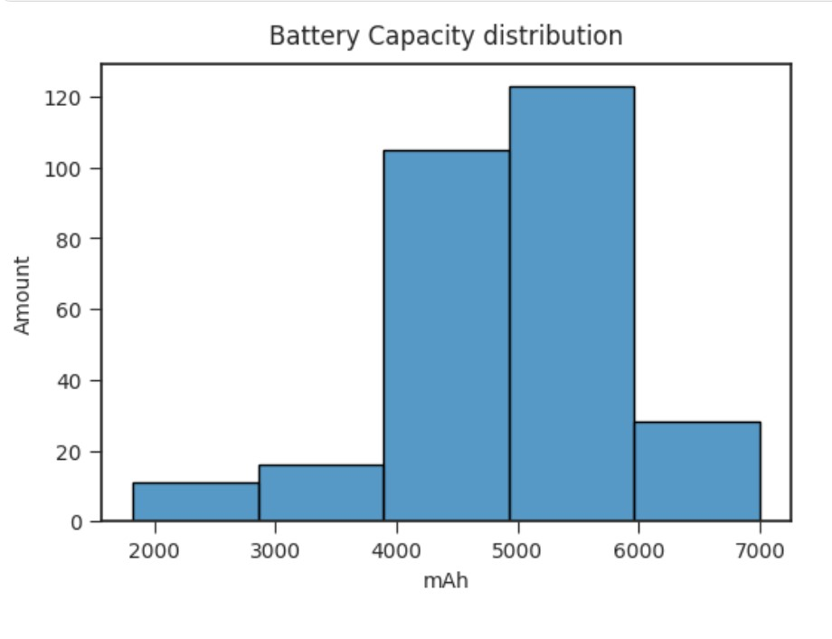
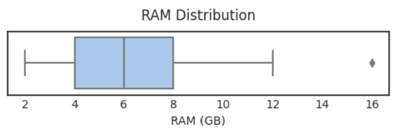
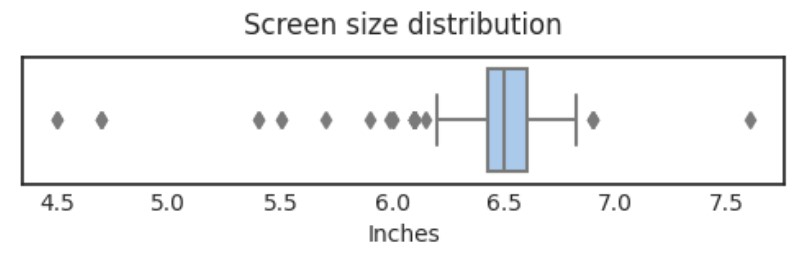
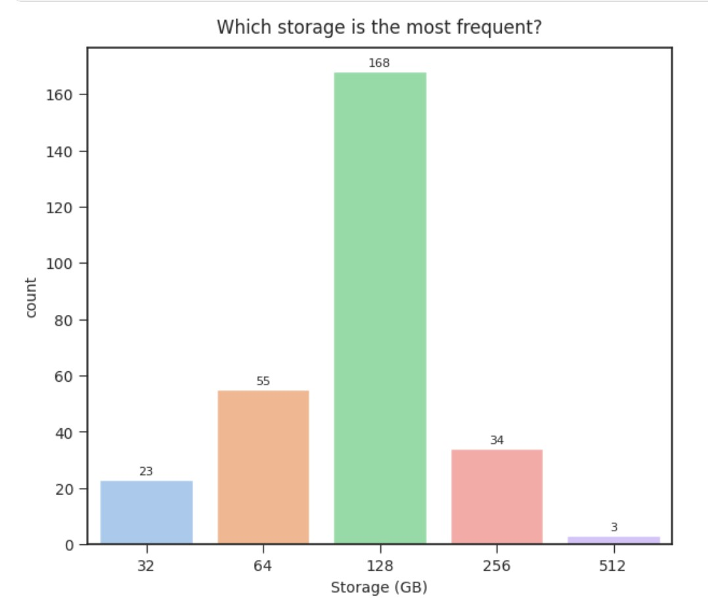
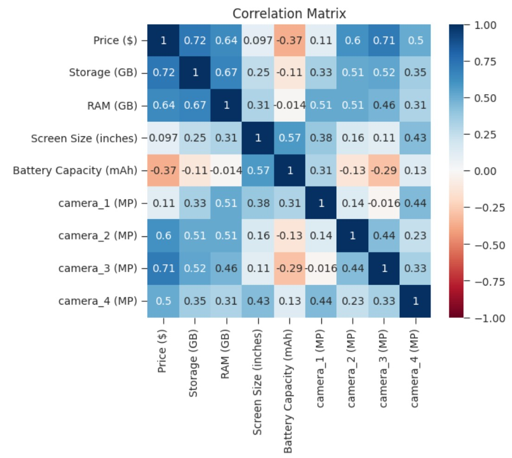

<h1>Data Analysis Portfolio Project 1. Mobile Phone Prices</h1>

<h2>Using a Kaggle dataset for Data cleaning, Feature engineering, Exploratory data analysis and exporting it to Power BI to create a dashboard.</h2>

**Skills used:**

+ Pandas
+ Numpy
+ Matplotlib
+ Seaborn
+ Power BI

Link to the Kaggle dataset: https://www.kaggle.com/datasets/rkiattisak/mobile-phone-price

This dataset contains information on the prices of several mobile phones from different brands. It includes details such as the storage capacity, RAM, screen size, camera specifications, battery capacity, and price of each device.

The raw dataset looks as follows:

1. Checking for missing values, duplicates, datatypes of the features and shape of the dataset.
2. Applying Feature Engineering on the features. One of the instances looks as follows:

Using regex, I extracted each camera and distributed them into new columns. Where there were fewer than 4 cameras, empty values were filled with "NaN."

3. The final appearance of the cleaned dataset:

4. Conducting EDA:

    
    

    
    

    
    

